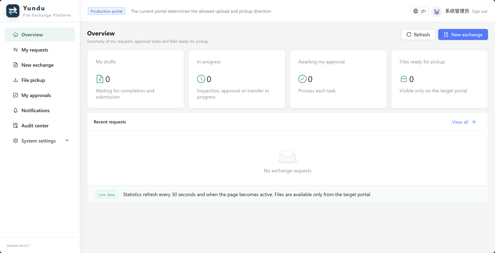

# Yundu File Exchange Platform

[简体中文](README.md) | [English](README.en.md)

Yundu is a controlled file exchange platform for enterprise office and production zones. It combines bidirectional storage replication, approval workflows, content inspection, target-portal pickup, and end-to-end auditing to make cross-zone file movement manageable and traceable.



> The current release is a V1.0 release candidate. Before production use, validate real object storage, Microsoft Authenticator, ClamAV, notification channels, monitoring, recovery, and load performance in your enterprise pre-production environment.

## Highlights

- Bidirectional file exchange between office and production zones.
- Department, team, user, business-system, and scoped role management.
- Visual approval workflow design, validation, simulation, publication, and direction binding.
- Hash, UTF-8, control-byte, binary-signature, extension, and content inspection.
- Exact S3/MinIO object-version replication with target-side integrity verification.
- Request-oriented file pickup by the original requester from the target portal.
- Versioned integrations, in-app notifications, WeCom delivery, monitoring, and audit archives.
- Chinese and English interfaces with permission-aware navigation.

## Screenshots

| Sign in | New exchange request |
|---|---|
|  |  |

| Overview | Audit center |
|---|---|
|  |  |

## Architecture

```text
Office portal ─────┐                         ┌─ MySQL 8.4
                   ├─ Nginx / HTTPS ─ Yundu ├─ Office-zone S3/MinIO
Production portal ─┘          (API + Web + Workers) └─ Production-zone S3/MinIO
```

- A modular Go monolith serves the API, background workers, and embedded web application.
- React, TypeScript, and Ant Design assets are compiled into the same binary.
- MySQL stores business state, sessions, audit events, jobs, leases, and monitoring aggregates.
- File contents remain in version-enabled S3/MinIO storage and are never stored in MySQL.
- The current deployment does not require Docker, Compose, Redis, a message broker, or endpoint agents.

## Security and Product Boundaries

- Office-to-production exchanges accept `.sql` and `.csv` files only.
- Each office-origin file is limited to 30 MiB; each request supports up to five files and 150 MiB in total.
- Yundu never executes uploaded SQL, scripts, or other files.
- Only the requester can pick up files from the target portal; administrators have no implicit download permission.
- Antivirus is disabled by default. A disabled scan is recorded as skipped, never as passed.
- Original filenames are separated from object keys. Submission freezes the exact Version ID and SHA-256.
- Local passwords use standard TOTP-based multi-factor authentication without bypass codes.

## Quick Start

### Requirements

- Go 1.26 for source builds
- Node.js and npm for frontend source builds
- MySQL 8.4
- Version-enabled S3/MinIO storage accessible from both zones

### Build the Monolithic Binary

```bash
git clone https://github.com/monotseng/yundu.git
cd yundu
cp configs/config.example.yaml configs/config.local.yaml
make build
```

The output is `release/yundu-linux-<arch>`. Frontend assets are embedded, so Node.js is not required on the target server.

### Configure and Initialize

```bash
export YUNDU_DB_PASSWORD='your-database-password'
export YUNDU_MASTER_KEY="$(openssl rand -base64 32)"

./release/yundu-linux-arm64 --check-config --config configs/config.local.yaml
./release/yundu-linux-arm64 --migrate --config configs/config.local.yaml
./release/yundu-linux-arm64 --bootstrap-admin admin \
  --display-name 'System Administrator' \
  --config configs/config.local.yaml
```

Generate `YUNDU_MASTER_KEY` once during the initial deployment and keep it permanently in a secret manager. Existing TOTP and integration credentials cannot be decrypted if this key is lost or replaced. The initial administrator activation token is also displayed only once.

### Start, Check, and Stop

```bash
./release/yundu-linux-arm64 --start \
  --config configs/config.local.yaml \
  --pid-file runtime/yundu.pid \
  --log-file runtime/yundu.log

./release/yundu-linux-arm64 --status --pid-file runtime/yundu.pid
./release/yundu-linux-arm64 --stop --pid-file runtime/yundu.pid
```

Health endpoints:

```bash
curl -fsS http://127.0.0.1:9080/health/live
curl -fsS http://127.0.0.1:9080/health/ready
```

## Verification

```bash
go test ./...
go vet ./...
cd web && npm ci && npm run typecheck && npm run build
```

Build standard AMD64 and ARM64 release packages:

```bash
make release-package VERSION=1.0.0-rc.3
```

## Documentation

- [Product guide (Chinese)](docs/product-guide.md)
- [Installation and user guide (Chinese)](docs/user-guide.md)
- [Deployment guide (Chinese)](docs/deployment-guide.md)
- [Operations runbook (Chinese)](docs/operations-runbook.md)
- [Identity operations (Chinese)](docs/identity-operations.md)
- [Database, key, and disaster recovery (Chinese)](docs/database-recovery.md)
- [Security validation and open risks (Chinese)](docs/security-validation.md)
- [Capacity and performance validation plan (Chinese)](docs/performance-validation.md)
- [OpenAPI](api/openapi.yaml)
- [V1.0 acceptance evidence matrix (Chinese)](docs/ac01-ac64-evidence.md)

## Release Status

The repository has completed development milestones M0 through M9. The latest standard release candidate is `v1.0.0-rc.3`; subsequent fixes are available on `main`. Enterprise-environment acceptance and production high-availability topology are not claimed as validated in the current release candidate.

## Security Notice

Never commit database passwords, master keys, S3 credentials, webhooks, API keys, activation tokens, or real TOTP screenshots. Production configuration should contain `${ENV_NAME}` placeholders, with secrets injected by a process manager or enterprise secret-management system.
