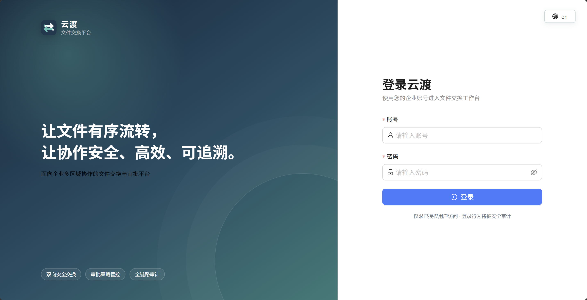

# 云渡（Yundu）文件交换平台

[简体中文](README.md) | [English](README.en.md)

云渡是面向企业办公区与生产区的受控文件交换平台。它通过双向存储复制、审批流程、内容检查、目标入口领取和全链路审计，让跨安全域文件流转可管理、可追踪。


> 当前版本为 V1.0 发布候选版。生产使用前仍需在企业预生产环境完成真实对象存储、Authenticator、ClamAV、通知、监控和负载验证。

## 核心能力

- 办公到生产、生产到办公双向文件交换。
- 部门、团队、用户、业务系统及范围化角色权限。
- 可视化审批流程编排、校验、模拟、发布和方向绑定。
- 文件哈希、UTF-8、控制字节、二进制特征和内容规则检查。
- S3/MinIO 精确对象版本复制与目标侧完整性复核。
- 按申请单集中展示、申请人从目标网络入口领取文件。
- 集成配置、站内通知、企业微信、监控和审计归档。
- 中文、英文界面切换与基于权限的菜单隔离。

## 产品界面

| 登录 | 新建交换 |
|---|---|
|  |  |

| 首页概览 | 集成配置 |
|---|---|
|  |  |

## 架构

```text
办公入口 ─┐                         ┌─ MySQL 8.4
          ├─ Nginx / HTTPS ─ 云渡单体服务 ├─ 办公区 S3/MinIO
生产入口 ─┘      　　　　　(API + Web + Worker) └─ 生产区 S3/MinIO
```

- Go 模块化单体提供 API、后台任务及嵌入式 Web 前端。
- React、TypeScript 和 Ant Design 构建后的资源嵌入同一二进制。
- MySQL 保存业务状态、会话、审计、任务、租约和监控聚合。
- 文件正文保存在启用版本控制的 S3/MinIO，不进入数据库。
- 当前部署不依赖 Docker、Compose、Redis、消息队列或终端 Agent。

## 运行边界

- 办公到生产仅接受 `.sql`、`.csv`。
- 单文件不超过 30 MiB，每单最多 5 个，合计不超过 150 MiB。
- 平台不执行上传的 SQL、脚本或其他文件。
- 只有申请人能在目标入口领取；管理员没有隐含下载权限。
- 杀毒默认关闭，关闭时明确记录为跳过，不宣称扫描通过。
- 文件原名与对象 Key 分离，审批提交后冻结 Version ID 与 SHA-256。

## 快速开始

### 环境要求

- Go 1.26（从源码构建时）
- Node.js 与 npm（从源码构建前端时）
- MySQL 8.4
- 两侧均可访问的版本化 S3/MinIO 存储

### 构建单体程序

```bash
git clone https://github.com/monotseng/yundu.git
cd yundu
cp configs/config.example.yaml configs/config.local.yaml
make build
```

构建产物为 `release/yundu-linux-<arch>`，前端资源已经嵌入，运行服务器无需安装 Node.js。

### 配置和初始化

```bash
export YUNDU_DB_PASSWORD='数据库密码'
export YUNDU_MASTER_KEY="$(openssl rand -base64 32)"

./release/yundu-linux-arm64 --check-config --config configs/config.local.yaml
./release/yundu-linux-arm64 --migrate --config configs/config.local.yaml
./release/yundu-linux-arm64 --bootstrap-admin admin \
  --display-name '系统管理员' --config configs/config.local.yaml
```

`YUNDU_MASTER_KEY` 只能在首次部署时生成一次，之后必须固定保存在密码保险库中。首次管理员激活凭据也只显示一次。

### 启动和停止

```bash
./release/yundu-linux-arm64 --start \
  --config configs/config.local.yaml \
  --pid-file runtime/yundu.pid \
  --log-file runtime/yundu.log

./release/yundu-linux-arm64 --status --pid-file runtime/yundu.pid
./release/yundu-linux-arm64 --stop --pid-file runtime/yundu.pid
```

健康检查：

```bash
curl -fsS http://127.0.0.1:9080/health/live
curl -fsS http://127.0.0.1:9080/health/ready
```

## 验证

```bash
go test ./...
go vet ./...
cd web && npm ci && npm run typecheck && npm run build
```

生成 AMD64、ARM64 标准发行包：

```bash
make release-package VERSION=1.0.0-rc.5
```

## 文档

- [产品功能说明](docs/product-guide.md)
- [安装与使用手册](docs/user-guide.md)
- [部署指南](docs/deployment-guide.md)
- [运行维护手册](docs/operations-runbook.md)
- [身份认证运行手册](docs/identity-operations.md)
- [数据库、密钥与灾难恢复](docs/database-recovery.md)
- [安全验证与未关闭风险](docs/security-validation.md)
- [容量与性能验证方案](docs/performance-validation.md)
- [OpenAPI](api/openapi.yaml)
- [V1.0 验收证据矩阵](docs/ac01-ac64-evidence.md)

## 发布状态

当前仓库已完成 M0～M9 开发里程碑。最新标准候选交付为 `v1.0.0-rc.5`。真实企业环境验收和生产高可用拓扑不在当前候选版本的已验证范围内。

## 安全提示

不要把数据库密码、主密钥、S3 凭据、Webhook、API Key、激活凭据或真实 TOTP 截图提交到仓库。生产配置应使用 `${ENV_NAME}` 占位并由进程管理器或企业秘密系统注入。
