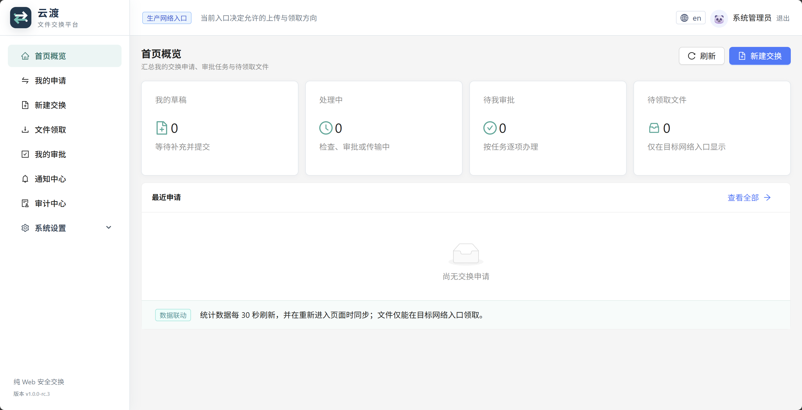
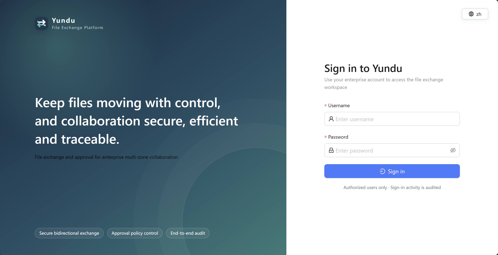
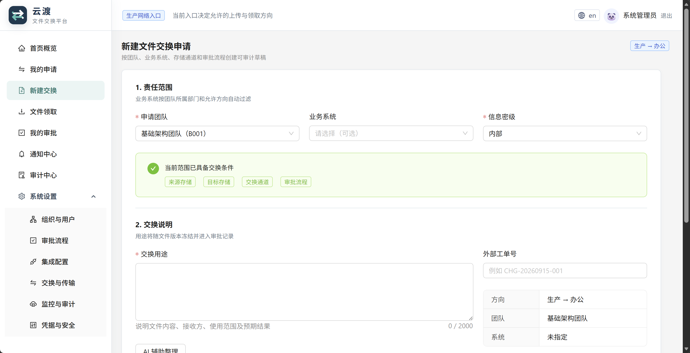
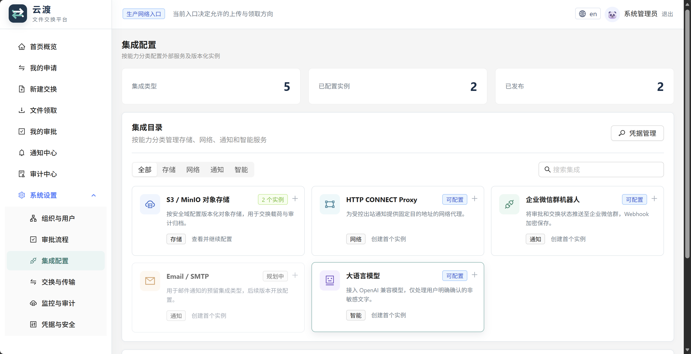
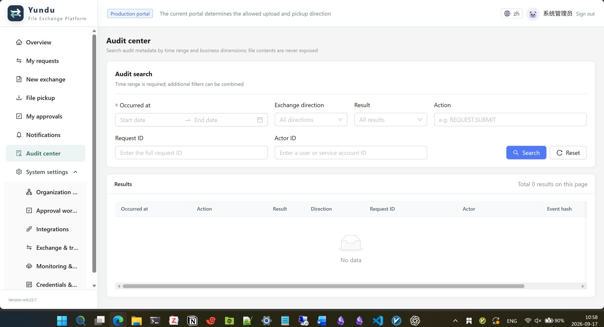

# 云渡文件交换平台：产品功能说明

## 1. 产品定位

云渡用于办公区域与生产区域之间的受控文件交换。系统采用浏览器访问、审批驱动、双向存储复制和全链路审计，不在终端安装 Agent，也不会执行上传的 SQL、脚本或其他文件。

平台由一个 Go 单体服务提供 API、后台任务和嵌入式 Web 前端，业务状态存储在 MySQL 8.4，文件正文存储在兼容 S3 的对象存储中。

## 2. 使用角色

| 角色 | 主要能力 |
|---|---|
| 普通用户 | 创建申请、上传文件、查看进度、在目标入口领取本人文件 |
| 团队负责人 | 审批所属团队的交换申请 |
| 部门责任人 | 审批所属部门的交换申请 |
| 安全复核人员 | 执行安全审批与必要的独立复核 |
| 系统管理员 | 维护组织、用户、业务系统、流程、存储和交换渠道 |
| 审计人员 | 查询审计事件、领取记录和系统运行信息 |

角色的实际菜单与操作权限由系统角色授权决定，未授权功能不会显示。

## 3. 核心功能

### 3.1 身份与权限

- 本地账号、密码和标准 TOTP 双因素认证。
- 支持在右上角切换中文和英文，语言偏好保存在当前浏览器中。
- 新用户通过一次性激活凭据设置密码并绑定验证器。
- 支持用户启停、团队归属、Emoji 头像、激活凭据重发和验证器重置复核。
- 支持按全局、部门或团队范围授权。
- 登录会话、敏感操作和管理员代办均保留实名审计记录。

### 3.2 组织与业务

- 维护部门、团队、团队负责人和成员关系。
- 维护业务系统及允许的交换方向。
- 团队、部门和业务系统可参与审批流程候选人解析和流程绑定。

### 3.3 文件交换申请

- 支持办公到生产、生产到办公两个方向。
- 新建申请时选择团队、业务系统、信息密级并填写交换用途。
- 办公到生产仅接受 `.sql`、`.csv`；单文件不超过 30 MiB、每单最多 5 个文件、合计不超过 150 MiB。
- 上传后冻结对象版本、文件大小和 SHA-256，提交后不能替换附件。
- 申请人可查看来源检查、审批节点、传输和领取状态。

### 3.4 文件检查与审批

- 对文件执行哈希、UTF-8、控制字节、二进制特征、扩展名和内容规则检查。
- 可选接入 ClamAV；未启用时明确记录为“未启用，已跳过”。
- 支持团队负责人、部门责任人、安全复核等节点。
- 支持单人、任一通过和全部会签模式。
- 流程可校验、模拟、发布、修订并按方向和业务范围绑定。

### 3.5 存储与传输

- 配置办公区域和生产区域的 S3/MinIO 存储实例。
- 按交换方向发布“源存储版本 → 目标存储版本”渠道。
- 审批通过后，后台工作器真实读取源对象并流式上传到目标对象。
- 目标侧重新校验文件大小、SHA-256 和内容规则；失败任务可重试或隔离。
- 推荐办公接收、生产交付、生产接收、办公交付使用独立存储桶和独立凭据。

### 3.6 文件领取

- 仅申请人可在目标网络入口领取文件，管理员没有隐含下载权限。
- 页面按申请单一行展示，展开后查看和领取单内文件。
- 每个文件使用短时、一次性的领取授权。
- 独立记录文件领取人、发送大小、结果和完成时间。

### 3.7 集成、通知与审计

- 集中维护对象存储、HTTP CONNECT 代理、企业微信机器人、SMTP 和兼容 Chat Completions 的模型服务。
- 通知中心聚合业务通知并保留投递状态。
- 审计中心按时间、操作者、申请、方向、动作和结果检索。
- 支持监控令牌、运行状态、安全事件和审计归档。

## 4. 典型业务流程

1. 管理员维护组织、用户、业务系统和角色授权。
2. 管理员配置并发布办公、生产对象存储。
3. 管理员配置双向交换渠道并发布审批流程。
4. 用户从文件来源入口创建申请并上传文件。
5. 系统完成来源检查，随后进入审批流程。
6. 审批完成后，传输工作器将文件复制到目标存储并再次校验。
7. 文件进入可领取状态，申请人从目标入口展开申请单并领取文件。
8. 系统记录整个过程的状态、版本、哈希、操作者和领取结果。

## 5. 部署边界

- 当前交付是单体二进制部署，不依赖 Docker 或 Compose。
- MySQL 与对象存储为外部依赖，不包含在发行包中。
- 前端已嵌入二进制，目标服务器不需要 Node.js。
- 正式环境应由 Nginx 等可信入口代理办公域和生产域，并启用 HTTPS。
- 高可用、多实例和容器化部署留作后续生产性能阶段。
